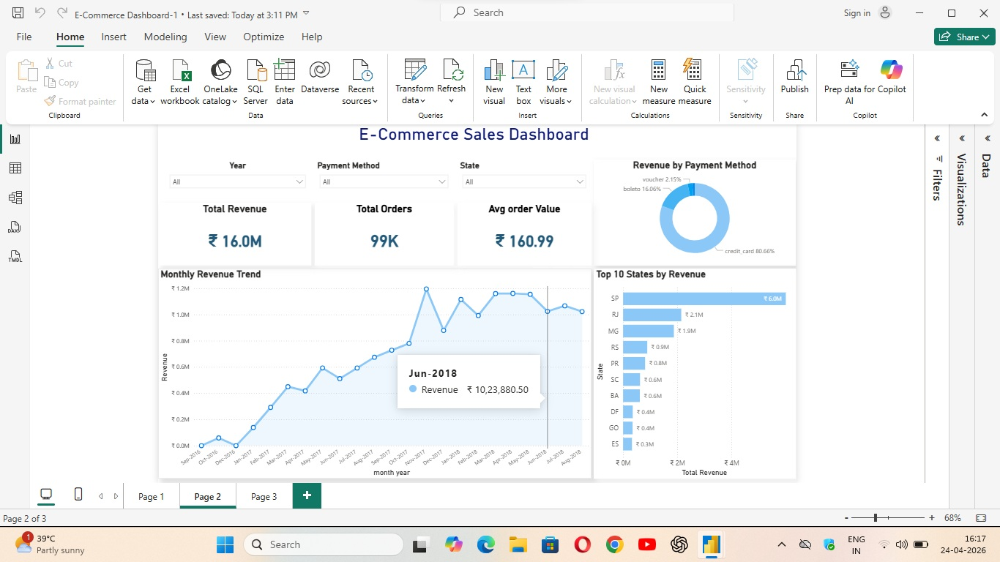

# E-Commerce Sales & Customer Insights Dashboard

## Overview
Built an interactive dashboard to analyze e-commerce sales performance, track key metrics, and uncover customer behavior insights for data-driven decision making.

---

## Objectives
- Monitor overall business performance using key KPIs  
- Analyze monthly revenue trends  
- Identify top-performing states  
- Understand customer payment behavior  

---

## Tools & Technologies
- SQL  
- Python (Pandas, NumPy)  
- Power BI  

---

## Project Workflow
1. Data Extraction using SQL  
2. Data Cleaning & Transformation using Python (Pandas)  
3. Data Analysis to identify trends and patterns  
4. Dashboard creation in Power BI for visualization  

---

## Dashboard Features
- KPI Metrics: Total Revenue, Total Orders, Average Order Value  
- Monthly Revenue Trend Analysis  
- Top 10 States by Revenue  
- Payment Method Distribution  
- Interactive Filters for dynamic analysis  

---

## Key Insights
- Revenue shows a steady upward trend with periodic fluctuations, indicating consistent business growth  
- A large share of revenue is concentrated in top-performing states, highlighting regional dependency  
- Credit card is the dominant payment method, indicating customer preference patterns  

---

## Business Recommendations
- Expand marketing strategies in underperforming regions  
- Encourage alternative payment methods to reduce dependency  
- Optimize inventory planning based on observed sales trends  

---

## Project Structure
data/ sql/ python/ dashboard/

---

## Dashboard Preview

---

## Conclusion
This project demonstrates the ability to transform raw data into meaningful insights and actionable business recommendations using data analytics tools.
